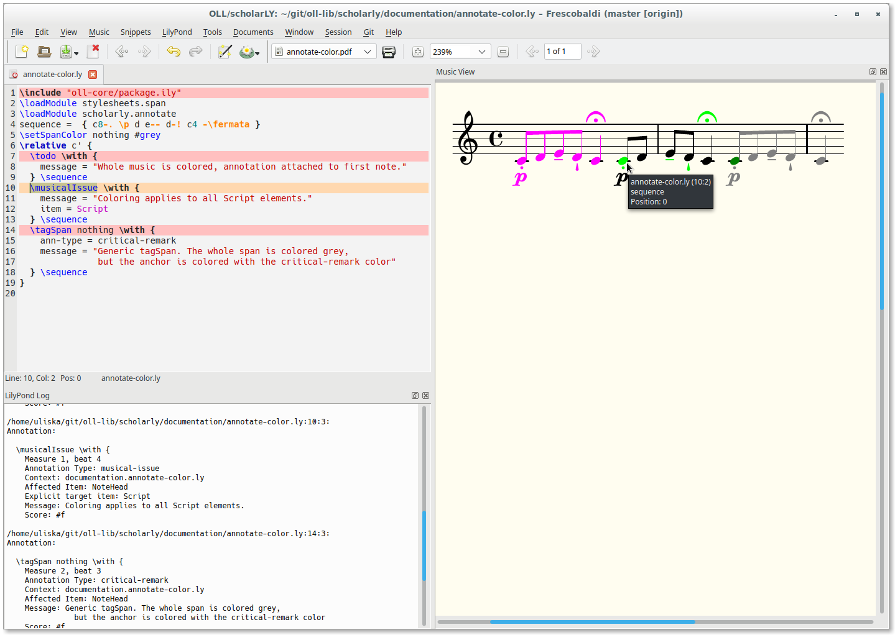

\pagebreak
# Introduction

\ollPackage{openLilyLib}^[<https://github.com/openlilylib>] (or “open LilyPond
Library”) is an extension system for the GNU LilyPond^[<http://lilypond.org>]
score writer.  It provides a plugin infrastructure, a general-purpose toolkit of
building blocks, and a growing number of packages for specific purposes. The
main intention is to encapsulate potentially complex programming and make it
available with a consistent and easy-to-use interface. **TODO:** Provide a
central source of documentation.

\ollPackage{scholarLY}^[<https://github.com/openlilylib/scholarly>] is a package
dedicated to the needs of scholarly editors, although its tools have proven
useful in general-purpose applications too, as a kind of “in-score communication
system” or “in-score issue tracker”. The main concerns of scholarly editions and
workflows addressed by the package are:

* *Handling annotations*  
  The package makes it possible to maintain the whole critical apparatus within
  the source files of the score itself, providing point-and-click navigation
  between score and annotations. These annotations can be the immediate source
  of  professionally typeset critical reports.^[Planned is also the support for
  attaching annotations directly to the graphical objects in SVG output and
  providing the means for interactive display of annotations.]  
  This is handled by the \ollPackage{scholarly.annotate} module.
* *Encoding source findings and editorial decisions*  
  The package provides commands to tag music with semantic editorial markup as
  part of the scholarly editor's duty to document their findings and decisions.
  It is possible to simply *document* these cases and get visual feedback
  through colors during the editing process, but it is also possible to
  persistently apply styles to arbitrary cases (for example: parenthesize
  editorial additions).  
  This is handled by the \ollPackage{scholarly.editorial-markup} module.
* *Encode alternative texts*  
  Typically editorial processes involve decisions to either choose from various
  readings or to make emendations to a text found in the sources. It is part of
  the duty to a scholarly editor to document all these cases, which
  traditionally is done in textual form in the critical report.  Digital
  editing techniques enjoy the possibility to directly *encode* such
  differences, and the package provides the necessary tools to do so. The
  encoding of alternative texts can be simply used as a means of
  *documentation*, but it can also produce alternative *renderings* of an
  edition.  
  This is handled by the \ollPackage{scholarly.choice} module.


## Installation and Dependencies

The installation of openLilyLib and its packages is described in the \ollPackage{oll-core} documentation.^[<https://github.com/openlilylib/oll-core/wiki>]
The code for the \ollPackage{scholarLY} package may be cloned or downloaded from `https://github.com/openlilylib/scholarly`.

\ollPackage{scholarLY} depends on the following openLilyLib packages that have
also to be installed:

* oll-core^[<https://github.com/openlilylib/oll-core>]
* stylesheets^[<https://github.com/openlilylib/stylesheets>]

To make \ollPackage{scholarLY} available to a LilyPond document first include
\ollPackage{oll-core}, then load the package with \cmd{loadPackage} or an
individual module with \cmd{loadModule}

```lilypond
\include "oll-core/package.ily"
\loadPackage \with {
  modules = annotate.editorial-markup.choice
}
```

# The `annotate` Module

\ollPackage{scholarly.annotate} is the core of the \ollPackage{scholarLY}
package, providing its most prominent feature with the handling of annotations
and critical apparatus. It came into existence with the goal of overcoming or at
least alleviating annoying limitations of traditional toolchains and workflows.

One of the most “sacred” duties of scholarly editors is not to determine the
perfect text but to transparently document and explain the rationale behind the
edited text, describing variant readings in the source(s) and revealing the
observations the decisions are based upon.  This is traditionally done in
textual form -- occasional music examples notwithstanding -- in critical reports
that live in separate documents from the score.

In a typical setting an editor is facing three separate entities: one or
multiple sources, the score being created, and the critical observations. There
are various ways to organize this, but the awkward reality is that the entities
are materially separate and not linked.  Keeping them synchronized during the
editing process is a tedious and error-prone effort.  A typical situation while
proof-reading is the evaluation of an observed difference between the source and
the new score: first the editor has to look up the corresponding measure in
their critical remarks and determine if this difference has been documented
already. If this is the case they can continue -- but more often than not they
will have to repeat this lookup in any subsequent run-through since there
usually is no visual indication in the new score. If there is *no* annotation
the editor has to decide whether they have to add an annotation, keep it as an
undocumented change, or change the text of the new score (optionally adding an
annotation anyway).

As critical editions may involve hundreds or thousands of such instances
proof-reading can amount to an unnerving sequence of context switches, with each
switch being complicated by the lack of synchronization between the different
entities.  \ollPackage{scholarly.annotate} significantly reduces the complexity
of the task by having the critical annotations encoded directly in the score
files while providing visual feedback and point-and-click navigation.
Additionally critical reports can be generated and professionally typeset
directly from these encoded annotations, avoiding the effort of keeping the
report up to date and the measure numbers in sync.

Annotations are encoded within the LilyPond input files, right next to the score
element they refer to.  This means the documentation of the editorial process is
maintained together with the edition data itself.  Through different annotation
types it is possible to discern between various stages of the process and
definitive critical remarks that are intended to be printed in the reports.

Two different feedback channels provide convenient access to annotations.
Annotations are printed in the console/log output, giving a convenient list to
review all annotations.  In editing environments like
*Frescobaldi*^[<http://frescobaldi.org>] this can be done with a simple key
combination, immediately positioning the input cursor at the annotations.  By
default annotations also highlight the annotated element through colors, making
them immediately obvious when browsing the score, for example while
proof-reading.  Clicking on the annotated elements again places the input cursor
at the annotation.  There are plans to add GUI support for annotation browsing
and editing in Frescobaldi.

Finally annotations can be exported to various file formats, creating the basis
for external tools to create reports from.  There are output routines for plain
text and \LaTeX\ so far, and HTML export is in development.  Other formats are
planned and can easily be plugged into the infrastructure.




## Creating Annotations

Annotations can be created in two different ways, first by issuing one of the
explicit annotation commands, second by turning a \cmd{tagSpan} or
\cmd{editorialMarkup} into an annotation.  Technically these are equivalent
since annotations directly build upon the functionality of \cmd{tagSpan}, but
there is a conceptual difference that should be considered on a case-by-case
basis.  An annotation “annotates” a score element or some music while spans or
editorial markup “tag” that music “as something” (for example an editorial
addition) and can be annotated *on top* of that.  The current chapter
exclusively uses explicit commands but keep this fact in mind when reading the
chapter about the \ollPackage{editorial-markup} module.

The syntax for creating annotations is one of these equivalent invocations:

```lilypond
<annotation-command> \with { <attribute> = <value> ... } <music>
\tagSpan annotation \with { <attribute> = <value> ... } <music>
\editorialMarkup <markup-type> \with { ann-type = <annotation-type> ... } <music>
\tagSpan <arbitrary-name> \with { ann-type = <annotation-type> ... } <music>
```

All of these can also be applied as post-event functions (prepending the leading
backslash with a directional operator), which is discussed shortly.

Note that adding the \option{ann-type} attribute to a span (or editorial-markup,
which technically *is* a span) will *create* an annotation, independently of the
\ollPackage{scholarLY} module. However, only when that module is loaded
annotations will also be *processed*.

There are various ways to apply annotations to music, and there are many things
to know about configuring annotations with attributes (content) and options
(processing), but these are described in later sections.


## The Five Annotation Types

There are five types of annotations^[It is possible to add custom annotation
types, but this is somewhat involved, and there is no convenient interface
available for it yet. Essentially the new type has to be registered in a number
of places and suitable defaults and handler functions defined.], used for
different tasks in the editing process.  The following list gives both the
command name and the corresponding \option{ann-type} attribute value:

* \cmd{criticalRemark} (\option{critical-remark})  
  Documents a definitive editorial finding or decision.
* \cmd{musicalIssue} (\option{musical-issue})  
  Points to an editorial observation that is considered an open question and
  has yet to be finalized
* \cmd{lilypondIssue} (\option{lilypond-issue})  
  Highlight technical issues that need to be resolved
* \cmd{question} (\option{question})  
  \cmd{todo} (\option{todo})  
  General-purpose annotations

Critical remarks and musical issues are typically used as inherent parts of a
scholarly workflow.  It is recommended practice to generously add
\cmd{musicalIssue} annotations for any observations and distill them to a more
concise set of \cmd{criticalRemark} entries throughout the process.  This
concept also has proven very efficient when applied to workflows with peer
review.

As these scholarly annotations usually refer to source findings and decisions it
is appropriate to use them as part of \cmd{editorialMarkup} entries, while the
other three annotation types lend themselves more to general-purpose “in-source
communication” or “issue tracker” usage and are therefore more inclined to be
used as standalone annotations (note that standalone annotations also can
annotate *spans* of music).

\ollIssue{Deprecation!}

With \ollPackage{scholarLY} version 0.6.0 the implementation of annotations has
been fundamentally rewritten.  This led to a breaking change in syntax while the
command names have been kept.

The old implementation of these commands is still available but has been moved
to the \ollPackage{scholarly.annotate.legacy} module. If you have used
\ollPackage{scholarLY} with the old interface and don't want to immediately
update your code you have to change the \cmd{loadModule} invocation  to
\cmd{loadModule scholarly.annotate.legacy} -- which of course will prevent you
from making use of any new functionality.

When the `item` after the \cmd{with} block is `NoteHead` it is usually
sufficient to simply remove that, but in other cases it may be more complex,
even if the result is more concise.

Apart from the incompatible input syntax the most significant difference is the
way how visual styling functions are applied to the annotated music.  In the
\ollPackage{legacy} module an annotation can/could be told to `apply` an
editorial function -- if one is defined.  In the new implementation the task of
applying styling functions is built into the spans themselves (both
\cmd{tagSpan} and \cmd{editorialMarkup}).  So the “editorial-command” is now
managed by the “span”, and the annotation is created on top of that
already-styled span, rather than having an annotation ask for the application of
a styling function.


## Application of Annotations

Annotations can be applied to sequential or single music expressions or as
post-events.  As has been said annotations build upon the \cmd{tagSpan} command
and share their behaviour with regard to their application to some music.
Therefore more details on that topic can be obtained from the
\ollPackage{stylesheets} manual.  While annotations can affect sequential music
expressions (which is visible by the coloring) they are technically attached to
the first element in them. This single or first element determines the reported
musical moment of the annotation.

The following examples should give a sufficient overview of the
options and possibilities.  They are limited to the most basic content, namely
the mandatory \option{message} attribute and in one case the \option{item}
attribute to affect a dedicated score element type.  A last example is used to
demonstrate the creation of footnotes and is included here because footnotes can
only be displayed in a fullpage example.

```{.lilypond include=annotations-page.ly}
```
\lilypondfile[insert=fullpage,nofragment,indent=0cm,debug]{annotations-page.ly}

## Authoring Annotation (Attributes/Content)

The *content* of annotations is defined through the attributes in a \cmd{with
\{\}} block, regardless of the way the annotation is applied to the music.
There are *mandatory* attributes, *known* attributes, *auto-generated*
attributes, and the option to use arbitrary *custom* attributes. We'll go
through each of these groups in turn.

### Mandatory Attributes

\ollOption{ann-type}{}
\ollOption{message}{}

The presence of two attributes is fundamental to making an annotation:
\option{ann-type} and \option{message}.  The \option{ann-type} attribute is what
actually makes an annotation an annotation. Every “span” has an annotation
attached, but only annotations with a dedicated type will be processed by the
annotation engraver.  The \option{ann-type} must be one of the five recognized
annotation types, and the explicit annotation commands transparently set this
attribute.

When an annotation is created the presence of \option{message} is mandatory. It
is a free-form text that is printed to the console and exported to files.  In
addition it is used as a fallback value for some other attributes.  If it is not
explicitly given a default value is supplied.

### Known Attributes

Annotations themselves don't check for selection and type of attributes,
basically *anything* can be supplied by users.  However, there is a number of
“known attributes”, i.e. attributes that have special meaning for spans or
annotations.  Generally all attributes handled by \ollPackage{stylesheets.span}
are available in annotations too, namely options to trigger footnotes, music
examples, or balloon text annotations.  Details can be found in the manual for
\ollPackage{stylesheets}.

Secondary code such as custom or public libraries may decide to recognize and
handle additional attributes, making them “known attributes” in *their* context.
For example, \ollPackage{scholarly.editorial-markup} provides a rule-set for
handling additional attributes.  \ollPackage{scholarly.annotate} also has its
own known attributes which are used in annotation export and therefore
documented in a later chapter.

### Custom Attributes

It is possible to add arbitrary attributes to an annotation, as long as the name
doesn't conflict with other known attributes. By itself the annotation does not
process such attributes but passes it through to the exported annotations.

Custom attributes may be used in two stages: they can be evaluated by styling
functions (working on the level of \cmd{tagSpan}), or they can be used from the
exported files, for example by a \LaTeX\ package typsetting critical reports.
The \option{lycritrprt}^[<https://github.com/uliska/lycritrprt>] package aims at
providing a convenient interface to processing such attributes through a
templating system.

### Generated Attributes {#generated-attributes}

When an annotation is processed by \ollPackage{annotate}'s engraver some
attributes are added and others are enriched with data that is only available in
that stage of the LilyPond compilation process.  The annotation engraver uses
context information to provide additional data to be stored in and eventually
exported with the annotation, so it is important to know about the underlying
mechanisms in order to properly set up the scores.

\ollOption{context-id}{<directory.file>}
\ollOption{context-label}{<directory.file>}

The *context id* is used to specify the “context” -- usually the staff
containing the  instrument/voice -- an annotation refers to.  Initially this
attribute is set to the value `<directory>.<file>`, so it is at least known in
which *file* an annotation has been defined. However, the *engraver* may narrow
this down to a more specific and especially *musical* identification.

If the annotation has a \option{context} attribute this takes precedent.

If the annotated music lives within any named context  (for example a Staff
created by \cmd{new} \cmd{Staff = "<some-voice-name>"}) the \option{context-id}
attribute is assigned this name “\<some-voice-name\>”.  The function retrieving
this information will walk up all the way from the bottom-level context (e.g.
\cmd{Voice}) where it is invoked up to the \cmd{Score} level if necessary.

If no explicit \option{context} has been provided and no named context is found
\option{context-id} falls back to the original directory/filename value.

However, the value to be used for *display* is actually \option{context-label}.
This is by default populated with the value of \option{context-id} unless that
can be found as a key in the \option{scholarly.annotate.context-names} lookup
table.  Keys can be mapped to labels with two functions:

```lilypond
\annotateSetContextName <context-id> <label>
\annotateSetContextName staff-vln-III "Vl. 3"
% or
\annotateSetContextNames <mappings>
\annotateSetContextNames
#'((01-vln-2 . "Geige 1")
   (02-vln-2 . "Geige 2")
   (03-vla . "Bratsche")
   (04-vc . "Cello"))
```

This is useful if the context-id values are either programmatically generated or
used to separate the display from sorting order.

\ollOption{score-id}{}
\ollOption{score-label}{}

Like with the context there is an option \option{score-id} that stores a score's
name if it has explicitly been named through \cmd{new Score = "my-score-name"}.
Other than with contexts a missing explicit name lets the attribute default to
`#f`.

Display names can be associated to score-ids through

```lilypond
\annotateSetScoreName <score-id> <label>
\annotateSetScoreName 03-adagio "Third movement - adagio"
\annotateSetScoreNames <mappings>
\annotateSetScoreNames
#'((01-allegro . "Allegro")
   (02-adagio . "Adagio")
   (03-presto . "Presto"))
```

This is useful if the score-id values are either programmatically generated or
used to separate the display from sorting order. If no \option{score-id} is
present the label defaults to an empty string.

Note that this is only relevant if there are multiple scores in the document.

\ollOption{grob-type}{}
\ollOption{grob-label}{}

As described earlier it is possible to target specific grob types through an
annotation's \option{item} attribute. However, whether explicitly or implicitly,
eventually an annotation is always attached to a *specific* score element (a
“grob”), and its type is made available as the \option{grob-type} attribute.
This attribute is *always* set, other than \option{item} which only holds a
value when set *explicitly*.  Note that in sequential music expressions the
`grob-type` is the type of the “anchor”, i.e. the first rhythmic event in the
expression or the first *note* within a chord.

\option{grob-type} always carries the name as used by LilyPond, but it is
possible to map a grob-type to a speaking  (or translated) \option{grob-label} through

```lilypond
\annotateSetGrobName <grob-type> <label>
\annotateSetGrobName NoteHead "Notenkopf"
\annotateSetGrobNames <mappings>
\annotateSetGrobNames
#'((NoteHead . "Notenkopf")
   (Hairpin . "Gabel")
   (Slur . "Bogen"))
```

\ollOption{grob-location}{}

The \option{grob-location} attribute holds detailed information about the annotation's moment
in musical time. It is an association list with the following keys:

* `beat-string`
* `beat-fraction`
* `beat-part`
* `our-beat`
* `measure-pos`
* `measure-no`
* `rhythmic-location`
* `meter`

These fields typically don't need to be bothered with but can be retrieved (in
LilyPond or at a later stage) to modify the presentation of the musical moment.
Details about the type and content of these fields can be found in
\ollPackage{oll-core.util.grob-location}.


## Processing Annotations

So far we have discussed how annotations are created and filled with content.
But of course the second part of the equation is equally important: processing
and export of annotations.

After the annotations have been recorded they are used for the output stage,
which includes the following steps (all can be toggled by configuration
options):

* Highlighting the annotated element through colors
* Printing to the console
* Exporting to various file formats

The first two are useful for reviewing and navigating the score while editing,
and the third is used to produce definitive reports that are automatically in
sync with the actual score.


### Some Technical Background and “Installation” Considerations

When the \ollPackage{scholarly.annotate} module is loaded two *engravers* are
implicitly loaded: `annotationColl<wector` and `annotationProcessor`. The
first is responsible for inspecting all score objects that have an `'input-annotation` property attached and create an annotation list from them, the second processes that
list, prints the annotations to the console and exports them to file(s).

By default `annotationCollector` is automatically called from (“\textbackslash
consist-ed” in) all bottom- (= voice) level contexts^[The complete list of
built-in contexts (Bottom and higher ones) can be found at
<http://lilypond.org/doc/v2.19/Documentation/internals/contexts>] For
convenience when the package is loaded. But it can be removed from arbitrary
contexts in a \cmd{layout \{\}} block, for example to reduce the engraver's
impact on performance.

> **TODO:** It is intended to have a module option to control which contexts are
> affected by the module, but this requires some changes to
> \ollPackage{oll-core} first.

`annotationProcessor` is consisted in the `Score` context, which should *not* be
modified since it is necessary to process *all* annotations at the end.

### Organizing Output

The most fundamental configuration of the annotation handling is the decision
what is going to be exported and to which target(s).  Most of these settings are
controlled through options, with \cmd{setOption scholarly.annotate.<option>
<value>} or \cmd{setChildOption scholarly.annotate.<main-option> <sub-option>
<value>} to change the default values.  However, in some cases there may be specialized commands available to simplify the configuration.

\ollOption{scholarly.annotate.export-targets}{\#'(console)}

The option \option{scholarly.annotate.export-targets} controls which targets the
annotations are exported to.  By default \option{console} is active, currently
supported additional targets are \option{latex} and \option{plaintext}.  Each target has its own conditions and configuration options, which will be described in dedicated sections below.

```lilypond
\setOption scholarly.annotate.export-targets console.latex
```

\ollOption{scholarly.annotate.ignored-types}{\#'()}

A list of annotation types (`critical-remark` etc.) that should be ignored for
processing.  Annotations of ignored type are skipped in an early stage of the
processing, so in large projects it may be efficient to ignore all types that
are not needed.

By default no types are ignored, i.e. all types are processed.

```lilypond
\setOption scholarly.annotate.ignored-types question.todo.lilypond-issue
```

\ollOption{scholarly.annotate.sort-by}{\#'(rhythmic-location)}

Annotations are exported in sorted order, by default according to musical time.
With this option one or multiple sort criteria can be specified, currently
supported these include:

* `rhythmic-location` (default) -- sort by musical time
* `type` -- sort by annotation type
* `author` -- sort by author (This will fail if any annotation does *not*
  have an `author` attribute)^[**TODO:** It should be made possible to add
  arbitrary attributes to the list of sort criteria, with a type or
  comparison-operator argument.]
* `score` -- sort by `score-id`  
  This is only relevant if more than one score is present in the current
  document and if all scores are explicitly named (otherwise compilation will
  fail).  In order to get meaningful results it is recommended to separate `score-id` from `score-label`.
* `context` -- sort by `context-id`  
  In order to get meaningful results it is also recommended to separate `context-id` from `context-label`

Note that annotations may be sorted by \ollPackage{scholarly.annotate} or at a
later stage by a “consumer”. It may depend on the context or necessity which
approach provides more functionality or is more efficient, but in general it
should be avoided to sort annotations *both* in LilyPond and later.  This means
that if you intend to sort annotations in a later stage it may be useful to
explicitly avoid sorting in LilyPond by setting the option to the empty list:

```lilypond
\setOption scholarly.annotate.sort-by #'()
```

\ollIssue{Wish}

It would be desirable to also *group* output by certain categories, allowing
some separating code to be placed between the groups.  But this hasn't been
concretely considered yet.


### Appearance of the Output

The use of colors is only relevant to the engraved *score* while the other
options affect the *exported* annotations.  Usually the options are globally
effective while exceptions are mentioned with the description of the export
target.


\ollOption{scholarly.annotate.use-colors}{\#\#t}

By default annotations are indicated through the application of the annotation
type's color.  This behaves differently for annotations created through explicit
annotation commands or those created by adding the \option{ann-type} attribute
to a \cmd{tagSpan}. In “real” annotations the whole span is colored in the
annotation type's color while in implicit annotations the span is colored in the
*span's* color and only the “anchor” then colored with the annotation's color.
However, if the span includes only a single element the annotation color
completely overwrites the span color.

In the following example the same music is annotated in three different ways:

* With a default \cmd{todo} annotation
* With a \cmd{musicalIssue} \cmd{with \{ item = Script \}} annotation, limiting
  the coloring to `Script` elements
* With a \cmd{tagSpan} that colors the whole span but only uses the first
  element to highlight the annotation.

```{.lilypond include=annotate-color.ly}
```
\lilypondfile{annotate-color.ly}


\ollOption{scholarly.annotate.colors}{\dots}
\ollLilyfuncdef{annotateSetColor}{type color}{}
\ollLilyfuncdef{annotateSetColors}{mappings}{}

The colors used for annotation types are stored in the
\option{scholarly.annotate.colors}.  By default critical remarks are dark
green, musical issues green, LilyPond issue red, questions blue and todo items
magenta.  

```lilypond
\annotateSetColor <type> <color>
\annotateSetColor critical-remark #blue
\annotateSetColors <mappings>
\annotateSetColors
#`((critical-remark . ,red)
   (musical-issue . ,darkgreen)
   lilypond-issue . ,green))
```

Please note that the use of the default colors makes them immediately
obvious to other package users, and you should only change them for good
reasons.


\ollOption{scholarly.annotate.attribute-labels}{}
\ollLilyfuncdef{annotateSetAttributeLabel}{name label}{}
\ollLilyfuncdef{annotateSetAttributeLabels}{mappings}{}

The display values for attribute keys in most output targets.  Default values are provided for all known attributes.  Custom labels are recommended for custom attributes, and they can be used to translate the output interface.


\ollOption{scholarly.annotate.skip-attributes}{}
\ollOption{scholarly.annotate.export.all-attributes}{\#\#f}
\ollOption{scholarly.annotate.export.latex.all-attributes}{\#\#t}

A list with attributes that can be suppress in the output is stored in
\option{scholarly.annotate.skip-attributes}.  Whether these are actually suppressed can be configured separately for \LaTeX\ and other targets because in \LaTeX\ it is much more common to want all attributes exported.  By default the \option{-all-attributes} option is active for \LaTeX\ and inactive for other targets.

```lilypond
\setOption scholarly.annotate export all-attributes ##t
\setOption scholarly.annotate export latex all-attributes ##f
```

For customization purposes the \option{scholarly.annotate.skip-attributes}
option can be overridden manually, for example to suppress additional custom
attributes or to selectively display attributes that are hidden by default.
Such an override will affect *all* export targets the same.


\ollOption{scholarly.annotate.context-names}{\#'()}
\ollOption{scholarly.annotate.score-names}{\#'()}
\ollOption{scholarly.annotate.grob-names}{\#'()}

These options that map internal names to speaking or translated display labels
have been discussed above in the section about [Generated
Attributes](#generated-attributes)

\ollOption{scholarly.annotate.export.type-labels}{}
\ollLilyfuncdef{annotateSetTypeLabel}{type label}{}
\ollLilyfuncdef{annotateSetTypeLabels}{mappings}{}

Display labels for the annotation type.

\ollIssue{Note:}

Currently the labels used in console and plaintext output to define the musical
moment can't be configured. Actually a template based system should be
implemented to configure this label.

## Exporting Annotations

When exporting annotations they will be stored in a file with the name
\option{<file-basename>.annotations.<extension>}.  This is not configurable so
far.  Various options that affect the way how annotations are exported in
general have been described above, the following sections provide details about
specific export targets.


### Printing to the Console

All configuration options for printing on the console have been described above.

If printing to the console is active then each annotation is printed as a
specific “warning” message, which has a few intended implications:

* The output includes a link back to the origin of the annotation.  Depending
  on the terminal environment this can be clickable (in *Frescobaldi* this is
  the case).
* Frescobaldi provides the keyboard shortcut `Ctrl+E` to iterate over all
  warnings and errors in the LilyPond log. The cursor is automatically placed
  at the origin of an annotation, opening the input file if necessary.  This is
  a convenient way to browse all annotations in a score.  *However*, too many
  annotations might obscure the log and make real warnings less obvious.  So it
  may be good practice to at least occasionally switch off the export to the
  console.
* When the cursor is automatically placed at the annotation's origin Frescobaldi
  automatically makes the corresponding score element visible in the Music
  Viewer and highlights it for some time with a colored rectangle.  To
  re-highlight the score element the keyboard shortcut `Ctrl+J` can be used
  repeatedly.


### Export to Plaintext

If `plaintext` export is active annotations will be exported to a very simple
text file `<basename>.annotations.log`.  This is currently not configurable
beyond the options described above, but maybe in the future a template-based
formatting system will be implemented if plaintext export is requested much.

### Export to \LaTeX

The `latex` export target is intended to produce code that can directly be used
by \LaTeX\ to typeset professional reports.  This is the most sophisticated
export channel to date, although it still has substantial rough edges and lots
of open feature requests.

Each annotation is exported to a single \LaTeX\ command with all exported
attributes placed in one optional argument, and it is up to the consuming
document/environment to provide appropriate commands to typeset a report from
them.

\ollPackage{scholarLY} includes a \LaTeX\ package in the `latex` directory that
aims at using the exported commands and all their features (more on that below),
but it is still under development and presumably not immediately usable with the
current state of the \ollPackage{scholarLY} LilyPond package itself.

Another \LaTeX\ package is
\ollPackage{lycritrprt}^[<https://github.com/uliska/lycritrprt>], which *does*
work but is still in its infancy and doesn't have any documentation beyond the
(generous) source comments.  It relies on the \LuaLaTeX\ engine and provides a
template-based system to configure the mapping of annotation attributes to
\LaTeX\ code, which seems quite promising.

\ollOption{scholarly.annotate.export.latex.commands}{}

\LaTeX\ export doesn't make use of the \option{type-labels} option but rather
uses command names stored in the
\option{scholarly.annotate.export.latex.commands} option.  By default these
match the LilyPond commands (\cmd{criticalRemark} etc.), and usually there
should be no reason to configure them.  Therefore no convenience commands have
been implemented, although the option can of course directly be set through
\cmd{setOption}.


\ollOption{scholarly.annotate.export.latex.use-lilyglyphs}{\#\#f}

If this option is active the annotation's musical moment is exported (to
\LaTeX) as a \ollPackage{lilyglyphs}^[<https://github.com/uliska/lilyglyphs]
command. This \LaTeX package (generally available, e.g. in \TeX{} Live)
provides LilyPond's notational elements to be included in continuous text, when
used with \ollPackage{scholarly.annotate} it uses musical symbols to denote the
indicate the musical moment of the annotation.

Note that this is not as robust as it should be at the time of writing.  The
supported metric and rhythmic elements are still quite limited, and there is no
support for a templating system.  Maybe it will be more promising to implement
such an approach in the \ollPackage{lycritrprt} package exclusively.


\ollIssue{NOTE/TODO}

What is it with the additional footnote commands to produce footnotes in the report? What about additional features to create music examples in the report etc.?

### Other Planned Export Targets

* HTML
* JSON
* Standalone \LaTeX\ document (with configurable documentclass and critical
  report package), optionally with implicit \LaTeX\ invocation.
* PDF (Cheaper options than \LaTeX?)
* Annotation browser (and even editor?) in Frescobaldi


# The `editorial-markup` Module

\ollPackage{scholarly.editorial-markup} provides tools to encode and visualize
source findings and editorial decisions. It is inspired by corresponding
sections of the MEI
specification^[<http://music-encoding.org/guidelines/v3/content/>] ^[<http://music-encoding.org/guidelines/v3/content/critapp.html>] ^[<http://music-encoding.org/guidelines/v3/content/edittrans.html>]
but has been adapted to LilyPond's use case. Internally it builds upon the
\ollPackage{stylesheets.span} module and provides specializations for the
specific application.


\ollPackage{scholarly.editorial-markup} provides the \cmd{editorialMarkup}
command to encode and visualize source findings and editorial decisions. Modeled
after MEI, the de-facto standard of (scholarly) digital music editing, it aims
at a unified interface for sharing scholarly workflows and -- hopefully -- data.

Technically \cmd{editorialMarkup} is a thin wrapper around \cmd{tagSpan} which
is defined in \ollPackage{stylesheets.span}, and it essentially provides a
specialized version of that command, tailoring a deliberately chosen set of span
classes, some additional validation rules, and default colors. As is documented
with the \ollPackage{span} module, adding an \option{ann-type} attribute
triggers the creation of an annotation, which is typically what one wants when
using editorial markup. The \ollPackage{scholarly.choice} module provides some
additional machinery for that.

Not yet implemented but an integral part of the concept is an infrastructure for
creating and managing styling functions suitable for the scholarly purpose.

Typically \cmd{editorialMarkup} is used within \cmd{choice} from the
\ollPackage{scholarly.choice} module to encode alternative versions of a musical
text.


## The \cmd{editorialMarkup} Command

The syntax and usage of \cmd{editorialMarkup} exactly matches that of
\cmd{tagSpan}: `\editorialMarkup <span-class> (<attributes>) <music>`, the only
difference being that `<span-class>` may not be an *arbitrary* name but must be
one out of the list of predefined types as described below. The mechanism of
applying the function to some music is identical, and so is the mechanism to
provide custom styling functions. The only difference is that validator
functions have been provided to match and enforce the predesigned data model of
scholarly editions. While it is *possible* to override the validators with
custom functions it is strongly discouraged.

```{.lilypond include=editorial-markup-basic.ly}
```
\lilypondfile{editorial-markup-basic.ly}

## Span Classes Defined By The Module

This section documents the allowed span-classes for \cmd{editorialMarkup}. They
refer to elements defined in the MEI specification, which is discussed with each
class. Some classes have rules about specific attributes while others are
neutral in this respect. In some cases default attribute names from MEI are
suggested but not enforced.

Note the in the majority of cases \cmd{editorialMarkup} will be used within
\cmd{choice}, and most classes form natural pairs or groups with other classes.
However, all of them may also be used standalone. Consider the basic case of an
apparent error like the a\flat\ in the example above. An edition could silently
correct the error, correct the error but identify the correction, print the
original text but mark it up as erroneous, or it could encode both, giving a
choice.

### Generic Attributes

MEI defines a number of generic attributes that can be applied to arbitrary
elements. Projects using \ollPackage{scholarly.editorial-markup} are encouraged
to make use of these attributes and enforce them. At least they should use the
standardized names if they make use of the functionality, rather than inventing
their own.

\ollOption{source}{}

The musical source to which the encoding applies. This may either be a literal
string or a reference to an entry in the sources list **TODO:** *This has to be
considered and implemented!* (`stemma` module?)

\ollOption{certainty}{}

Indicates the level of certainty attributed to the finding. If the option
\option{scholarly.certainty-levels} contains a list with values only values from
this list are allowed. **TODO:** *This has to be implemented!*

\ollOption{responsible}{}

Indicates who is responsible for the encoded fact. If the span tags a source
finding the responsibility points to the person that is presumably responsible
for what is found in the source, if an editorial decision is tagged, the
responsibility refers to the *current* editor.

\ollOption{agent}{}

This too indicates a responsibility, but rather than a person it is usually
meant to refer to tools or other external forces (an `agent` could be “razor”,
“dust”, “age” etc.).

\ollOption{type}{}

While some classes *require* a `type` attribute it may freely be used with any
classes.

\ollOption{reason}{}

A short phrase (shorter than the `message`) arguing about the reason of a
finding.

### Span Classes

\ollOption{lemma}{}
\ollOption{reading}{}

Used with \cmd{choice variants}.

Alternative readings from different sources. `lemma` is the reading chosen by
the editor while `reading` encodes the reading from  a secondary source. Both
classes require the \option{source} attribute. A \option{sequence} attribute may
be used to encode the (assumed) order in the genesis of the work.

\ollOption{addition}{}
\ollOption{deletion}{}
\ollOption{restoration}{}

Used with \cmd{choice substitution}

Modification processes *in the source*. `restoration` refers to the case when a
previously deleted text is restored to its original state. It is recommended to
use the \option{responsibility} and \option{agent} attributes with these
classes.

\ollOption{original}{}

Used with \cmd{choice normalization}

Refers to a musical text encoded literally although it deviates from the desired
presentation without being erroneous. Typical cases include the distribution of
hands to piano staves, abbreviations or similar operations (both to music or
text), stem (or other) directions, beaming patterns etc.

\ollOption{regularization}{}

Documents that a text has been normalized or modernized in the sense of the
previous \option{original}.


\ollOption{gap}{}

This and the remaining classes are used together with \cmd{choice emendation}.

Documents missing material in the source. Requires the attribute
\option{reason}.

\ollOption{sic}{}

Marks up erroneous content in the score.

\ollOption{unclear}{}

Used to mark up a text that can't be transcribed reliably. It is encouraged to
make use of the \option{certainty} and \option{responsibility} attributes.

\ollOption{correction}{}

Encodes the text as corrected by the current editor. Requires the \option{type}
attribute, which must be one out of \option{addition}, \option{deletion}, and
\option{substitution}. The use of \option{certainty} and \option{responsibility}
is encouraged.


# The `choice` Module

In most cases one doesn't only want to “tag” musical elements with an
\cmd{editorialMarkup} but also their alternatives. When explicitly naming
corrections corrections one will often document the erroneous text found in the
source. This can add value to a textual commentary describing the differences,
and it can be used to create alternative versions of an edition.

\cmd{choice} provides an infrastructure for this, enabling the encoding of
alternative versions of some music, choosing one version for use in the
engraving, and handling the annotations attached to the music spans. Note that
LilyPond can't support “live” updates to switch between versions in real time.

## The \cmd{choice} Command

The \cmd{choice} command has the interface `\choice <choice-type> (<attributes>)
<music>` where `<choice-type>` is an (partially arbitrary) name, `<attributes>`
and optional \cmd{with \{\}} block with additional attributes, and music a
special type of music expression: it is a sequential music expression whose
child elements are \cmd{span} music expressions. \cmd{editorialMarkup} fulfills
that definition, too.

Choice types may be arbitrary but beyond four predefined types adding custom
types involves significant configuration and programming work. These four types
are tuned to work with \cmd{editorialCommand} in a scholarly edition project:
`variants`, `normalization`, `substitution`, and `emendation`. Each choice type
has rules regarding its children's span classes and a configurable function for
choosing the child to be used for engraving. The following example documents
that in the source one whole note has been changed into two half notes. This is
valid code, although in a real-world example the finding would probably be
described in more detail through attributes like \option{reason},
\option{certainty} or \option{responsibility}. In this case by default the “new”
version is printed

```{.lilypond include=choice-basic.ly}
```
\lilypondfile{choice-basic.ly}

### Selecting the Music to be Engraved

The selection which subexpression is used for engraving is controlled by
`preference` variables registered for each choice type. These are set with
\cmd{setChoicePreference <choice-type> <value>}. `<choice-type>` is a Scheme
symbol while the value can be of arbitrary Scheme type, depending on the choice
type. The accepted values for the preconfigured choice types are documented
along with the types, but custom choice types may implement tests of arbitrary
complexity. Note that since arbitrary Scheme values are accepted for the second
argument also symbols have to be given in their explicit Scheme notation with
the prepended hash sign: \cmd{setChoicePreference substitution \#'old}.

Generally, if the selection process fails (usually because there is no suitable
music expression available) the first encountered music expression is chosen.
Apart from that the order of encoding spans in a choice expression is
irrelevant.

### `variants`

\cmd{choice variants} is used to encode alternative readings from different
sources. It must contain exactly one span of class \option{lemma} and one or
more \option{reading} span(s). Other span classes are not allowed.

By default the \option{lemma} span is engraved, otherwise the `preference`
option must be set to the desired reading's \option{source} attribute.

The following example sets up a \cmd{choice} as a music function. This is
unrealistically complicated but serves to show how changing the preference uses
different subexpressions from the choice:

```{.lilypond include=choice-variants.ly}
```
\lilypondfile{choice-variants.ly}

### `normalization`

\cmd{choice normalization} is used to encode a version literally along with some
adaptation to modern or standardized editing conventions. The expansion of
abbreviations (e.g. tremolos, repeats) also falls into this category. This
choice type is used when consistent or modern presentation is desired and the
deviations in the sources have to be documented. Note that the original text is
not considered faulty in this case.

The choice must contain exactly one \option{original} and one
\option{regularization} span. By default the regularization is chosen, and the
preference values are `original` and `regularization`.

**QUESTION:** *Should they have a mandatory `type` attribute to define things like type=abbreviation etc.?*

### `substitution`

\cmd{choice substitution} is used to document modifications applied within the
source, typically a correction from one text to a different one.

The choice must contain one \option{deletion} and one \option{addition} *or*
\option{restoration} span. By default the final state is printed, and the
preference values are \option{new} and \option{old} (as Scheme symbols).

### `emendation`

\cmd{choice emendation} is used to document editorial decisions. The choice must
contain exactly two subexpressions, one being the \option{correction}, the other
being one out of \option{sic}, \option{gap} or \option{unclear}.

By default the correction is engraved, the preference values are \option{old}
and \option{new}.


## Handling Annotations in a Choice Expression

A central topic when dealing with choices of editorial markup expressions is the
handling of annotations. Details about annotations can be looked up in the
documentation of \ollPackage{stylesheets.span} (annotations are created from a
span expression) and the \ollPackage{scholarly.annotate} chapter later in this
document. But \cmd{choice} provides some interesting features to manage
annotations.

Any span (or editorial markup) expression implicitly carries a `span-annotation`
attached to its “anchor” element, and if that includes an \option{ann-type}
attribute a “real” annotation is created and processed by
\ollPackage{scholarly.annotate}. By design \cmd{choice} selects one span
expression from its subexpressions and returns that, so implicitly the result of
\cmd{choice} carries the annotation of the chosen span.

If the \cmd{choice} itself has attributes too (the optional argument) they are
*merged* with the chosen subexpression's annotation attributes. If an attribute
is present both in the choice and in the selected subexpression the “lower” one
from the subexpression overwrites the one from the wrapping choice. This makes
it possible to create sophisticated annotations, for example to print an
alternative `message` text depending on the chosen subexpression.

```{.lilypond include=choice-complex-annotation.ly}
```
\lilypondfile{choice-complex-annotation.ly}

## Custom Choice Types

The \ollPackage{scholarly.choice} module has been developed with a certain use
case in mind and was therefore modeled after parts of the MEI specification.
However, nothing speaks against extending this with custom choice types and
rulesets.

Adding a custom choice type involves implementing and registering one function
for validating choice expressions and one for handling the selection preference.

### Creating a Choice Validator

A choice validator is a function created with the macro
\option{(define-choice-validator)}. This creates a scheme-function expecting one
`choice-type` symbol and a `choice-music?` music expression. The function body
must consist of one expression (optionally preceded by a docstring) and evaluate
to a true value or `#f`.

Inside the function a number of variables and local functions are available:

* \option{spans}  
  a list of pairs with the span class as `car` and the music expression as `cdr`
* \option{classes}  
  an ordered list of span class names. *Note:* generally the order of spans in a
  choice expressions is ignored, but it is *possible* for custom validators to
  make a decision based on the order.
* \option{(count-class <class>)}  
  computes the number of times the given span class is present
* \option{(single <class>)}  
  returns `#t` if the given class appears exactly once
* \option{(optional <class>)}  
  returns `#c` if the given class appears zero or one times
* \option{warning-message}  
  if this variable is set to a string this string is output as part of the
  warning message reporting an invalid choice expression.

### Registering a Validator

Once a validator function is defined it can be made accessible through
\cmd{setChoiceValidator <choice-type> <function>} where `<choice-type>` is a
Scheme symbol and `<function>` a procedure. It is also possible to register
multiple validators at once with \cmd{setChoiceValidators <validators-list}}
where the argument is an association list linking choice type symbols to
validator procedures.


### Creating a Span Chooser

A span chooser is a function created with the macro
\option{(define-span-chooser)}. This creates a scheme-function expecting one
`choice-type` symbol, a `props` alist and a `span-expressions?` list of
span-class/span-music pairs. The function body must consist of one expression
(optionally preceded by a docstring) and evaluate to a span-class/span-music
pair.

Inside the function the following names are available:

* `preference`  
  a key as base data for the decision which span to choose. If the choice
  attributes include a \option{preference} attribute its value is taken,
  otherwise the value is looked up in the options as they are described above.
* `(get-annotation <expression>)`  
  a function to retrieve the span annotation from the given span expression.
  If the chooser function iterates over the expressions this is the way to
  access the current expression's annotation.

The built-in choosers all have comparably simple binary selection mechanisms,
but custom functions may implement conditions of arbitrary complexity. Note that
the `preference` value doesn't necessarily have to be a simple symbol as in the
built-in cases. it may also make sense to use for example lists and choose the
first expression that happens to match a list element (use case: use readings
from sources in descending priority).

### Registering a Span Chooser

Once a span chooser is defined it can be made accessible through
\cmd{setSpanChooser <choice-type <function>} where `<choice-type>` is a Scheme
symbol and `<function>` a procedure.


# The `sources` Module

This is a stub as there is no \ollPackage{scholarly.sources} module yet, not
even a sketch.  This module will provide an interface to storing information
about musical sources.  Intended functionality:

* Reference by key in an annotation's `source` attribute
* Produce output for source descriptions in critical reports  
  (optionally: output only sources used (if possible/appropriate))
* Maintain inheritance information to create a stemma.
* Optionally: produce a graphical representation of a stemma (thorugh \LaTeX?)


\printindex
\addcontentsline{toc}{section}{Index}
